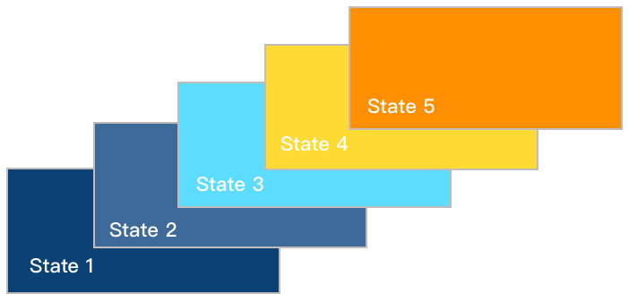
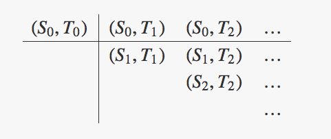
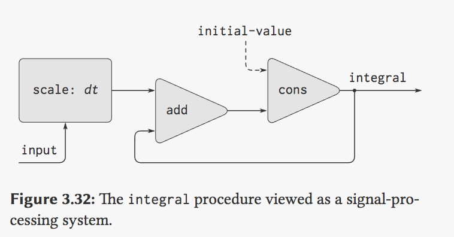

在上一篇文章之中我们见识到了基于变动数据、内部状态的程序设计的能力，但是就像之前提及过多次的引用透明性的问题被打破，程序中引入了时间的概念，导致我们无论是求值顺序还是过程的运行都出现了一个时序性的问题，我们在 `数字电路模拟` 之中使用了一个 *待处理表* 的子过程，用来为我们的信号传播进行排序，通过模拟延时构造了程序的时序性。但是在现实世界中，我们不可能只通过一张表去排序构造顺序，现实系统中的对象都有更为复杂的同时的活动，为了构造这种更为现实的模拟系统，我们可能需要：

* 使用一组系统进行对同时发生的事情进行模拟
* 分解我们使用的模型，增强内部状态的演化，就是更为 **模块化**
* 能够支持多个进程的硬件支持

在多内核处理器普及的今天，硬件支持已经渐渐不是并发编程的难题了。但是并发编程的复杂性让然没有因为这个原因而降低难度。首先我们要承认正确的运用并行编程是有利的，能提升我们程序的运行效率和对硬件的利用率。

但是由于并发系统的时间的不确定性，两个同时运行并有所依赖的进程，我们并不能确定什么时候某个能运行完，而一个又不能对另一个的结果进行无限的等待。还有就是资源获取的问题，两个并行的程序如何对资源进行管理，比如第三章开始的那个例子，从银行取钱，如果无法控制程序对资源的有效管理就可能造成两个人同时使用一个账户同时取钱，都能取出来的情况出现。

这一节会谈及和并发相关的内容，对于有编程理论经验的同学，这并不是什么复杂的理论内容，其中涉及到的时序控制、锁和信号量等等的知识都是能在各种 OS 相关的课程和书中了解到的知识。

## 并发和时间

> 时间是一种设施，发明它就是为了不让所有事情都立即发生。

从抽象的角度来看时间就像是加在事件上的一种顺序，一件事情发生比另一件事情发生的早，只是事件顺序的相对关系，这个过程听起来能够非常原子的控制，但是本身事件还会消耗时间。这就引出了并发带来的一些问题，之前也已经提到了，来自于对相同资源的控制问题，和操作的顺序问题，解决这个问题我们就是在解决程序的 **正确性** 和 **健壮性** 的问题，通常我们可以这么去理解程序的正确性：

* 并发运行不受外界的影响
* 运行的表现要和不进行并发程序的状态是一样的

### 并发控制

对正确性的保证其实就是在做和 **并发控制** 相关的工作，其实质就是对并行操作进行一定的控制，书中谈到的很多策略其实在做开发中都是经常见到的：

#### 禁止所有共享资源的并行操作

> Tips : 
>
> 锁粒度： 简单说就是指不允许并行运行的加锁区域。

其实典型就是加了个 *锁* ，但是问题也比较明显，书中的反面 Demo 明显是一个锁粒度设定非常大的例子，这也是这种方案的一个比较突出的缺陷，并不是所有的时间都需要禁止并行进行。很多操作并非互相干扰的，比如非常常见的 **读写分离** 锁就是这样，我们很多时候对读操作和写操作的要求不同不能一概而论。

#### 允许不互相干扰的并发

书中提到了另一种控制方式，是对一种想法的一种改进，这时候我们允许对很多的不互相干扰的并发执行，但是对结果的要求仅仅期望与某种顺序的运行方式相同，这样会有另一个方面的问题，并发结果有很多种，我们没办法对其结果进行预测。

### 串行控制器

串行化控制器的思路就是，程序可以并行执行，但是其中也有时序性的要求的部分，这部分无法并行执行程序的部分就靠一个控制器，将所有的执行过程通过一个集合控制起来，同一个时间段只会有一个过程在执行。最简单的应用我们可以借助共享变量去理解，同一个时间段可能有很多个进程在请求同一个资源，但是 *同时* 只能有一个进程能够获得这个资源，其余的将在等待队列中等待：


通过对程序的分组的方式来禁止不正当的并发行为，并且可通过程序控制将某个方法设置为 **串行化** 的方法。

我们引入一个内部方法 `make-serializer` 去提供这个是过程串行化的功能，`make-serializer`  接受一个过程作为参数返回同样行为的过程，参数与原过程保持一样，但保证其执行被串行化，我们可以继续使用之前的 `make-account` 的例子：

``` lisp
(define (make-account balance)
  (define (withdraw amount)
    (if (>= balance amount)
        (begin (set! balance (- balance amount)) balance)
        "Insufficient funds"))
  (define (deposit amount)
    (set! balance (+ balance amount))
     balance)
  ; 引入内部过程 make-serializer 
  (let ((protected (make-serializer)))
    (define (dispatch m)
      (cond ((eq? m 'withdraw) (protected withdraw))
            ((eq? m 'deposit) (protected deposit))
            ((eq? m 'balance) balance)
            (else (error "Unknown request -- MAKE-ACCOUNT" m))))
    dispatch))
```

可以看出我们引入了内部过程，通过对每个向外暴露的方法包装一层方法。

> Tips：
>
> 这里面可以类比 Java 中的 synchronized 和 Lock 机制，在实际的开发中使用 synchronized 设置为某个方法的关键字，这样我们对某个方法的封装就能让具体的处理业务 *互斥* 进行处理。

#### 多重资源的复杂性

我们考虑完单一资源的串行化操作之后来看一下涉及到多重资源的程序，比如刚才对 account 的操作，如果我们提供一个过程能够交换两个账户的金额（通过计算差值分别赋值给两个账户）：

``` lisp
(define (exchange account1 account2)
  (let ((difference (- (account1 'balance) (account2 'balance))))
    ((account1 'withdraw) difference)
    ((account2 'deposit) difference)))
```

但是这就涉及到了另外一个问题，这个的操作确实能在对两个账户进行使用的时候保持并发正确，但是如果我们同时运行两个这个程序分别交换 `account1` 和 `account2` 以及 `account2` 和 `account3` 的时候，这时候情况就变得复杂了，account 的操作能保证串行化，但是 `exchange` 的程序还没有保证串行化。

这时候我们就要改变 `exchange` 的串行租的策略，我们要是能够使用两个 account 的用户的串行组就能让 `exchange` 过程也并行正确，这里我们提取出了对应方法，把串行租从账户模块中暴露出来，这样就能在想加锁的时候用上锁了：

``` lisp
; 还是那段 make-account
; ... 
(let ((serializer (make-serializer)))
    (define (dispatch m)
      (cond ((eq? m 'withdraw) withdraw)
            ((eq? m 'deposit) deposit)
            ((eq? m 'balance) balance)
        	((eq? m 'serializer) serializer)
            (else (error "Unknown request -- MAKE-ACCOUNT" m))))
    dispatch))
; ...
```

我们可以看到我们在程序内部没有给操作的过程加锁，而是把锁暴露在了外面，这样我们对操作的定义可能需要一定的修改：

``` lisp
(define (deposit account amount)
  (let ((s (account 'serializer)) 
        (d (account 'deposit)))
    ((s d) amount)))
```

我们的 `exchange` 的定义也可以用提取出来的串行控制器进行重构了：

``` lisp
(define (serialized-exchange account1 account2)
  (let ((serializer1 (account1 'serializer))
        (serializer2 (account2 'serializer)))
    ((serializer1 (serializer2 exchange)) account1 account2)))
```

分别把两个串行控制器提取出来了，并且确信要拿到两道锁的 exchange 程序来操作两个账户。

看起来我们实现了我们所需要的整个功能不是么？可是未必意识到了我们对这个程序都做了什么，首先我们来看修改版本的 **deposit** 程序，这个 deposit 明显已经不是 account 的一个内部方法了，这是在外面包裹了一层的一个新的方法，破坏了本身的模块和封装。

而且在看我们对 **serializer** 的使用上来看，明显和上个原因相同以外，我们暴露的是对象所在的串行组，想想串行组是用来管理资源的，这个东西都暴露在了模块的外部，无论是使用还是管理起来都是特别不方便还容易出现危险。

> Tips :
>
> 我们之前简单的描述过，可以把这里提到的串行控制器等价于我们在实际开发中使用的 **锁**，多种资源引来的复杂性实际上就是程序所使用的锁的数量不足，不能有效的管控所有的资源。而我们在程序的修改的结果其实就是拆解了模块，把我们的 **锁** 暴露在了外部，对于封装和安全的问题可想而知。

#### 串行控制器的实现

我们刚才在谈及串行控制器的实质上面，我们可以把它想象成一把锁和一个请求锁的等待队列，在书中的模拟中是使用了 **互斥量(mutex)** 这个更为细粒度的抽象数据实现的。

互斥元是一个可以被获取、在使用之后被释放的数据抽象（类比锁实现），如果某个互斥元已经被获取，想获取该互斥元的其他操作需要等到该互斥元被释放（任何时候只有一个进程能拿到），来看 `make-serializer` 的实现过程：

``` lisp
(define (make-serializer)
  ; 创建互斥元
  (let ((mutex (make-mutex)))
    (lambda (p)
      (define (serialized-p .args)
        ; 获取互斥元
        (mutex 'acquire)
        ; 执行 p 过程
        (let ((val (apply p args)))
             ; 释放互斥元
          (mutex 'release)
          val))
      serialized-p)))
```

这就是我们之前生成串行控制器的过程，以一个过程作为参数，我们先对获取互斥元再执行完过程 `p` 然后再释放我们的互斥元。我们还需要一个生成互斥元的过程：

``` lisp
(define (make-mutex)
  (let ((cell (list false)))
    (define (the-mutex m)
      (cond ((eq? m 'acquire)
             (if (test-and-set! cell)
                 (the-mutex 'acquire)))
            ((eq? m 'release)
             (set-car! cell false))))
    the-mutex))
```

注意到互斥元的管理本身也是依赖一个变量来操作的，其中的 `test-and-set!` 检查参数的 car 值，如果参数的 car 值为假就在返回值前将其设为真值。

`test-and-set!` 这个方法是生成互斥元的核心，这个操作需要以 **原子操作** 的方式执行，具体实现可能是一个特殊的硬件指令或者是系统提供的一个专门的过程。在单处理器程序中系统通过轮转时间片的方式为每一个可执行程序安排一段运行时间，多处理器机器中我们就必须通过硬件支持的专门指令。

#### 死锁

在资源抢占和申请的过程中，我们会遇到更为严重的问题 —— 死锁。我们刚才对 `serialized-exchange` 的修改之后，通过增加一条锁，已经能让我们在交换账户的时候控制好时序性了，但是我们还可能遇到资源互相抢占的问题比如文中的例子：

> 实例：设 Peter 要交换账户 a1 和 a2，同时 Paul 想交换 a2 和 a1
>
> * 假定 Peter 进程已进入保护 a1 的串行化过程，与此同时 Paul 也进入了保护 a2 的串行化过程
> * 这时 Peter 占着保护 a1 的串行化过程，等待进入保护 a2 的过程（等待 Paul 的进程释放该过程），而 Paul 占有保护 a2 的串行化过程，并等待进入保护 a1 的过程
> * 两人的进程将相互等待，永远也不能前进


这样两个以上的进程，由于相互等待其他方释放资源无法前进，这种情况我们就称之为死锁，如果并发系统涉及到多种资源的管理和申请，就有可能出现死锁。

## 流

之前我们引入赋值是为了解决对状态的 **模拟** 的问题，之前的数字电路模拟之中也向我们证实了使用赋值的方式是一种正确的实现模拟的方式。但是同时我们也意识到了一个新的问题，一个由引入赋值带来的问题——计算对象包含可变的局部状态，并且这种状态是根据时间可变的了，在这种情况之下我们就不再能像之前一样把所有数据都当成不可变数据来进行计算了。

因此本节讨论的 **流** 就是为了解决引入赋值所产生的状态变化问题而引入的，目的是使用另一种方法来进行模拟。之前我们对时间的模拟来自于对状态根据时间的修改，也就是说一个具体的状态在不同的时间之下是不同的，不断地修改状态实现了模拟就像下图一样一个局部状态在不断地被修改和覆盖：



而使用 **流** 来模拟采取了另一种方式来对状态随时间这个事实进行模拟，我们假设每一个状态 $x$ 都包含一个随时间进行改变状态的函数 $x(t)$ ，每一个时间片 $t$ 都对应着一个 $x$ 的具体状态，在这种角度来看虽然时间、状态仍然在进行着变化，但是 **由时间到状态的映射** $x(t)$ 本身是不变的。因此我们就可以不再只关注 $x$ 本身作为一个变化量的变化，但是从整个时间的流逝角度来看时间和状态的映射函数本身是不变的。

> Tips：关于上面用 $x(t)$ 来解释流的原因
>
> SICP 用上述使用 $x(t)$ 的方式来解释 stream 的实质，其实不是在说 stream 是用来保存一个 state x 的变化过程 (随说可以提供这个功能，但是这个听起来很像是 state monad)，其实 stream 更像是一个 `operator` 的作用。

如书中所说我们如果从离散步长的角度上来讲，流可以被看做一个无限长的序列，通过对不同时间阶段内容的取值，来模拟由时间到状态的映射。但是从实现的角度上来讲我们并不能为了实现流而构造一个无限长度的队列，因此引入一种延迟求值的技术来表示任意（以致无限长度的序列）。

> 在[编程语言理论](https://zh.wikipedia.org/wiki/%E7%A8%8B%E5%BC%8F%E8%AA%9E%E8%A8%80%E7%90%86%E8%AB%96)中，**惰性求值**（英语：Lazy Evaluation），又译为**惰性计算**、**懒惰求值**，也称为**传需求调用**（call-by-need），是一个[计算机编程](https://zh.wikipedia.org/wiki/%E8%AE%A1%E7%AE%97%E6%9C%BA%E7%BC%96%E7%A8%8B)中的一个概念，它的目的是要最小化计算机要做的工作。它有两个相关而又有区别的含意，可以表示为“延迟求值”和“最小化求值”，惰性计算的最重要的好处是它可以构造一个无限的[数据类型](https://zh.wikipedia.org/wiki/%E6%95%B8%E6%93%9A%E9%A1%9E%E5%9E%8B)。
>
> 惰性求值的相反是[及早求值](https://zh.wikipedia.org/wiki/%E5%8F%8A%E6%97%A9%E6%B1%82%E5%80%BC)，这是一个大多数[编程语言](https://zh.wikipedia.org/wiki/%E7%BC%96%E7%A8%8B%E8%AF%AD%E8%A8%80)所拥有的普通计算方式。
>
> —— wiki

如果我们在了解延迟求值的技术之前，我们编写的代码是会在编写完立刻执行的，即使没运行到也是因为处理时间过长等因素在一段时间之后自动运行到。而延迟求值则是相当于把求值的方法写在了代码里但是不会立刻运行，而是在我们需要的时候调用，并且使用当时的 context 来进行计算得到结果。有了这样的一种表示方式，我们自然而然的可以多次调用来生成多个不同状态下的结果，并最终形成一个我们想要长度的序列。其实不需要向书中卖那么长的关子，听到这学过之前内容的同学应该已经能想到了，一个能带 context 的、不会立刻进行计算的东西 —— lambda 就呼之欲出了。

事实上 Scheme 之中的延迟求值的实现也非常简单就是使用 lambda 的封装进行的：

``` scheme
; 使用 delay 包裹
(define (delay expr)
  (lambda() expr))

; 使用 force 直接拿出来调用
(define (force expr)
  (expr))
```

因此通过这样延时求值的定义我们能够做出之前我们无法实现的一些操作，比如书中的一个无限的正整数流：

``` scheme
; 1) 直接 cons 生成 stream
(define (integers-starting-from n)
  (cons-stream n (integers-starting-from (+ n 1))))
(define integers (integers-starting-from 1))
; 2) 隐式生成的 stream
(define ones (cons-stream 1 ones))
(define (add-streams s1 s2)
  (stream-map + s1 s2))
(define integers2 (cons-stream 1 (add-streams ones integers2)))
```

使计算过程中事件的 **实际发生顺序** 和 **过程表面结构** 之间的对应关系变得比较宽松，因此既能获得之前我们探索模块化获得的优势，又能在效率上有所提升。

### 流计算的应用

通过引入 `流` 这种编程概念对我们的编程方式有很大的补充能力，使用流式编程构造系统的时候本质上和使用状态和变量来构造系统有很大的区别。但其实更简单的理解方式还是可以从前几章我们所说的 `引用透明`，流的实质也不过是过程传递和延迟加载技术的综合。书中介绍的几个流计算的应用，包括引入迭代、无穷流和和之前呼应的表示信号。

#### 将迭代操作表示为流操作

``` scheme
(define (sqrt-improve guess x) (average guess (/ x guess)))
; 求一个数的平方根
(define (sqrt-stream x)
  (define guesses
    (cons-stream 1.0
                 (stream-map (lambda (guess) (sqrt-improve guess x))
                             guesses)))
; 打印出整个流
(display-stream (sqrt-stream 2))
```

还有一个例子是通过交错级数不断地收敛来生成 $π$ 的近似值：
$$
\frac{π}{4} = 1 - \frac{1}{3} + \frac{1}{5} - \frac{1}{7} + .....
$$

``` scheme
; 生成交错级数的流
(define (pi-summands n)
  (cons-stream (/ 1.0 n)
               (stream-map - (pi-summands (+ n 2)))))
; 部分前缀和 exercise 3.55 有提到
(define (partial-sums s)
  (cons-stream (stream-car s)
               (add-streams (stream-cdr s)
                            (partial-sums s))))
; pi 的近似流
(define pi-stream
  (scale-stream (partial-sums (pi-summands 1)) 4))
```

> Tips :  流的加速收敛
>
> 书中包含了针对这个交错级数的加速方案 euler-transform：
>
> 加速的项目为：
> $$
> S{n+1} - \frac{(S{n+1} - S {n}) ^ 2}{S{n-1} - 2 S{n} + S{n+1}}
> $$
>
> ```scheme
> (define (euler-transform s)
>   (let ((s0 (stream-ref s 0))     ; Sn₋₁
>         (s1 (stream-ref s 1))     ; Sn
>         (s2 (stream-ref s 2)))    ; Sn₊₁
>     (cons-stream 
>      (- s2 (/ (square (- s2 s1))
>               (+ s0 (* -2 s1) s2)))
>      (euler-transform (stream-cdr s)))))
> ```

#### 无穷序列



``` scheme
(define (pairs s t)
  (cons-stream
   (list (stream-car s) (stream-car t))
   (⟨combine-in-some-way⟩
    (stream-map (lambda (x) 
                  (list (stream-car s) x))
                (stream-cdr t))
    (pairs (stream-cdr s)
           (stream-cdr t)))))
```

尝试通过 stream 的方式去生成如上图所示的无穷序列，途中主要分成了三个区域，最左上角的初始序对，和右上角的 list ，还有就是右下角的部分。

``` scheme
; (S0, T0)
(list (stream-car s) (stream-car t)) 
; (S0, T1) , (S0, T2), (S0, T3) ,...
(stream-map (lambda (x)  
              (list (stream-car s) x))
            (stream-cdr t))
; 交错 items
(pairs (stream-cdr s)
       (stream-cdr t))
```

而其中比较重要的部分就是怎么组合两个 inf-stream 的，普通的 `stream-append` 肯定是不行的，因为这样会一直在求值第一个 stream ，这里使用了下述的方法来交错的使用 inf-stream：

``` scheme
(define (interleave s1 s2)
  (if (stream-null? s1)
      s2
      (cons-stream 
       (stream-car s1)
       (interleave s2 (stream-cdr s1)))))
```

#### 将流作为信号

前面以信号处理为背景讨论流问题。也可以用流建模信号处理过程，用流中元素表示一个信号在一系列顺序时间点上的值：
$$
S{i} = C + \sum_{j-1}^{i}x_{j}d{t}
$$

``` scheme
(define (integral integrand initial-value dt)
  (define int
    (cons-stream 
     initial-value
     (add-streams (scale-stream integrand dt)
                  int)))
  int)
```

通过积分器的方式表示信号系统：



### 流计算的问题

流的大量使用会导致系统之中有很多部分需要显示的使用 `delay` ，`force` 进行管理，一种解决办法就是把系统中的 `应用序` 求值全部换成 `正则序` 求值。这样的求值方式更加接近流的使用方式，统一了参数的求值逻辑。但是全部换成了 `正则序 ` 后可能真实的求值时间就不能够得到保障了，并且本身理解程序也会有一些困难，程序的语义也变得复杂起来了。书中的归并账号的问题也向我们揭示了另一个问题，在处理这种并发的约束条件的时候我们不能用分片、轮流的方式(这明显和实际情况不符)，因此还是要引入强制的同步。

## 总结

本章主要是在讨论有内部状态的对象，基于状态编程和模拟，我们提供了两种解决方案去表示对时间的模拟，但是都不能尽善尽美。首先是通过局部变量的模拟，对于赋值和状态的讨论是本章贯穿的内容，我们进一步揭示了赋值的引入本质上是是对时间的依赖，赋值改变了变量的状态，从而改变了依赖于这些变量的表达式的计算。具有变动状态的对象给程序带来了时间问题，程序本身也失去了引用透明性，并发会使得问题变得更加严重。引入流是作为一种替代技术，延时求值的序列是很强力模拟工具，能在一定范围内替代赋值的状态模拟。而状态变动、时间模拟、程序的非确定性这种本质性问题也很难有最优解存在。